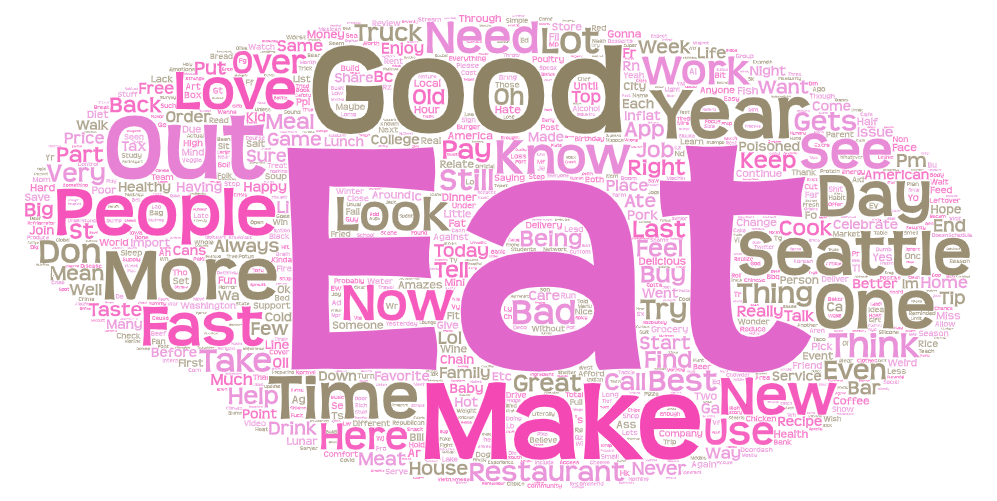
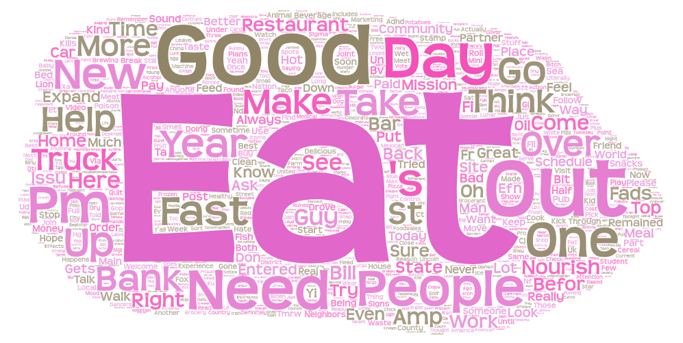
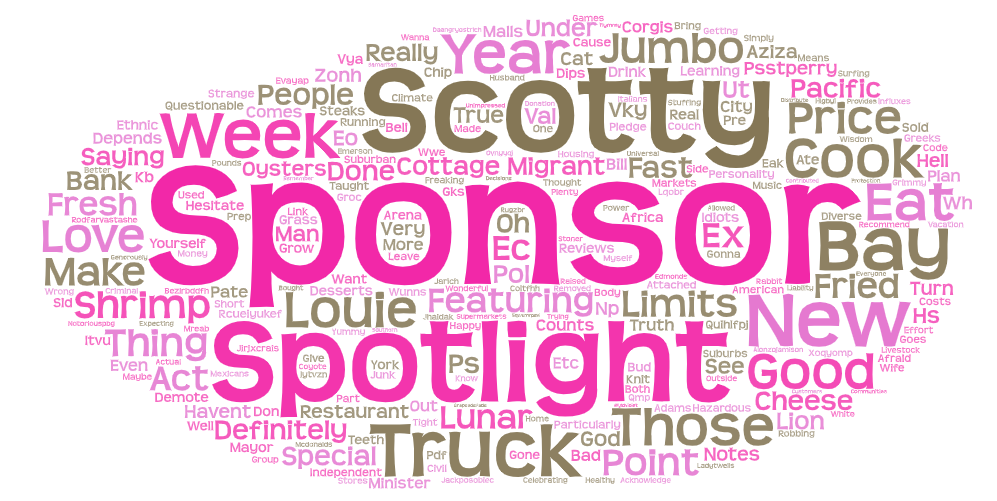

# Word Cloud 1

* Bellevue area

Download the csv data file 1 [here](asset/Lab2CSV1.csv)

# Word Cloud 2

* Tacoma area

Download the csv data file 2 [here](asset/Lab2CSV2.csv)

# Word Cloud 3

* Lynwood Area

Download the csv data file 3 [here](asset/Lab2CSV3.csv)

# Narrative

For these Word Clouds, I decided to observe the word **"Food"** as a topic. I chose this topic because **"Food"** is one of the best interests of everyone and one of the most popular conversation topics. In order to create three Word Clouds with the theme of food, we selected three different areas in Washington State. First, I selected **Bellevue**, **Tacoma**, and **Lynwood** for a wide range observation. I set Bellevue with 12.6 miles, Tacoma with 8.5 miles, and Lynwood with 4.5 miles in the parameter range so that the areas did not overlap.

After creating Word Clouds, I removed unnecessary words directly related to food, so it makes better understand the contexts of my chosen topic in most cases. I removed the word such as, **"up, go, food, co, foodspot, amp, live, cat, Danzyl"** from first word cloud. For second word cloud, I removed **"food, co, cat, gas, ye, girl, lol, ass, fuck, miss"** and for third word cloud, I removed **"food, co, Ydbi, Hwcr, Uxkwsxh, TI, Wzz, Yd, Fcffiipf, Knottybadwolf, Gkghkowfl."** All of these words are onomatopoeia or typographical words that are not related to the word "food". Also some words like **"food"** and **"co"** are not a substantial semantic component of the tweet messages.

The reason why I compare these three regions on the subject of food is because I wondered what words will people mention about food, who living in three different regions with different industrial and regional atmospheres. As the local environment is different, I think there is an influence that the viewpoint of thought changes.
When comparing the three Word Clouds, the words **"Eat,"** **"Good,"** and **"Make"** were the most visualized words in the Bellevue area.
Word Cloud in the Tacoma area also expressed **"Eat"** and **"Good"** the most, but unlike Bellevue, **"Need"** and **"People"** were mentioned, which is not directly related to food, but environmental and expressive words. The most interesting was the Word Cloud in the Lynwood area. Although the scope of observation was small, unlike the existing two Word Clouds, words such as **"Sponsor,"** **"Spotlight,"** and **"Scotty"** were visualized the most. It can be analyzed that people in Lynwood are more interested in industrial aspects such as food-related investment and job creation.

The pattern I found was that the words **"Food,"** and **"Co"** were the most common words that I had removed previously, and most of the other words in the Word Cloud searched for similar words. This can be defined as the word "food" that everyone got similar perspectives. One thing I regret in this research is that I have observed a very narrow range. Next time, it would be better to observe a wider range of areas and conduct more diverse analyzes. Honestly, the word **"food"** comes to everyone in a similar way. Therefore, the words to think and the words to search are all similar, and the search field is expected to be slightly different. But Word Cloud in the Lynwood area was completely beyond my expectations. It was interesting that industrial expressions were searched the most, not expressions that emphasized eating and pleasure.